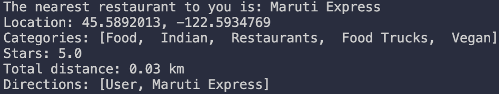

# Finding the Shortest Path
Our application finds the shortest path to the closest restaurant in [Yelp's business dataset](https://www.yelp.com/dataset/documentation/main) given the user's location.

Done by: Akshaya, Bai, Charlotte, Kylie, Viddya


## Running our Application:
1. **Clone this repository:**
```
    git clone https://github.com/by-bai/cs201project.git
```

2. **Set user's location:** (App.java:12)
```java
    Double[] userLocation = {40.0175444, -105.28335}; 
```

3. **Choose the algorithm** (App.java:28)

```java
    /** 
     0 - Brute Force Algorithm
     1 - Dijkstra's Algorithm with Priority Queue
     2 - Bellman Ford Algorithm
     3 - Dijsktra's Algorithm with Adjacency List 
     */
     
    int algo = 3
```

4. **Choose the dataset** (App.java:31)

```java

    // datasets available: business.csv, businesstest10.csv, businesstest100.csv, businesstest100000.csv
    
    List<Business> allBusinessList = FileReader.readFile("data/business.csv");
```

5. **Run the following commands:**
```
    source compile.bat
    source run.bat
```

6. **Sample output:**


7. **Modify Parameters:** <br />
possible parameters to experiment with to obtain different results.

- App.java:17 - **maxDistance**: find businesses within this distance from user's location
- App.java:20 - **minRating**: find restaurant above this rating (inclusive)
- App.java:23 - **neighbourDistance**: distance for 2 businesses to be connected in the graph


